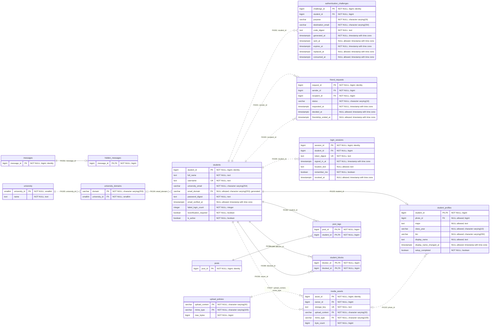
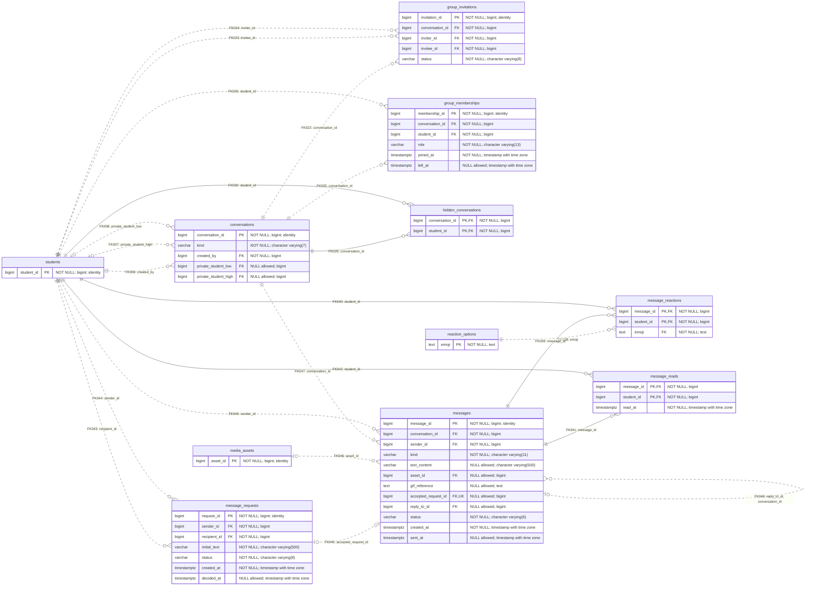
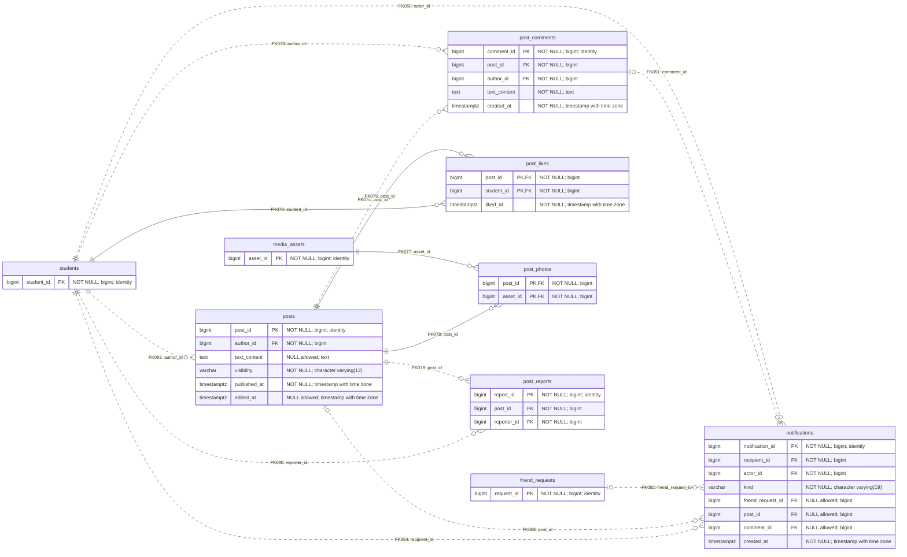
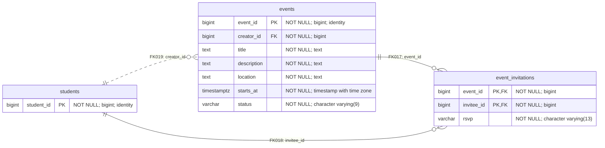
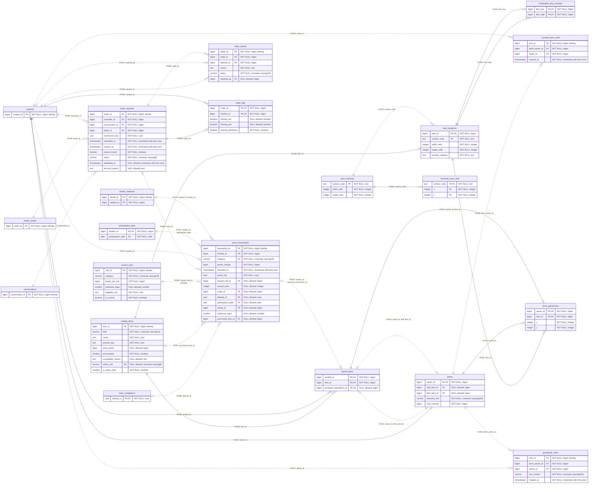
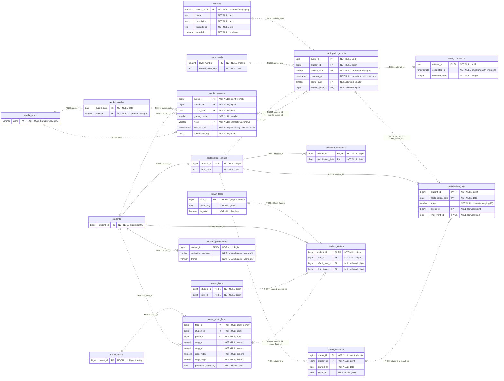

# SocialU - Entity Relationship Diagram

**59 tables | 283 columns | 109 foreign keys | 14 composite foreign keys**

Open [the interactive ERD](SocialU_ERD.html) to zoom, choose a person, search for a table, and inspect its keys and relationships. The [PDF](SocialU_ERD.pdf) contains the full diagram and six feature diagrams. The Mermaid diagrams below are editable text.

## Source and scope

- Source: `database/schema.sql`; SHA-256 `cfadaa90ee900e61591aec091f0f707acc9a47610d0cccaa6502608e7cc58d65`.
- Generated: 2026-09-29. The SQL was executed in an isolated PostgreSQL/PGlite database and relationships were read from its catalog.
- This is the local schema snapshot used for this ERD, not an inspection of the live Supabase database.
- Existing Git tracking metadata shows a later `UNIQUE (post_id, reporter_id)` addition. That later constraint is not in this local source snapshot; it does not change the 109 foreign-key links.
- The six SQL views are derived queries, not additional entity tables. Functions, triggers, conditional uniqueness and CHECK rules refine behavior beyond the foreign-key diagram.

## Reading the diagram

- `PK`: primary-key column. Multiple PK markers together form the composite primary key.
- `FK`: foreign-key column. Multiple-column foreign keys remain one numbered relationship.
- `UK`: an unconditional single-column unique key. Composite and conditional unique indexes are available in the interactive table details.
- `?` in the PDF/interactive diagram: column allows NULL.
- Relationship ends: `1` = exactly one; `0..1` = zero or one; `0..*` = zero or many. A circle means optional, a bar means one, and a crow foot means many.
- Solid line: all child FK columns are part of the child primary key (identifying relationship). Dashed line: non-identifying relationship.
- Cardinalities describe the general FK/nullability/unconditional-uniqueness rules. Conditional CHECK and trigger rules may make a relationship mandatory or more restrictive for particular records.
- Each feature diagram shows its owned tables and their referenced parent tables. Gray headers are reference-only tables. Incoming links from other features appear in the complete diagram.

## Responsibility

| Member | Tables | Feature |
| --- | ---: | --- |
| Linh Nguyen (LN) | 12 | Accounts, profiles and shared media |
| Loens Paul (LP) | 9 | Chat and messaging |
| Merieme Sakhsoukhi (MS) | 6 | Feeds and social interactions |
| Kabanga Mbangu (KB) | 2 | Events and invitations |
| Darrin Phimphisane (DP) | 15 | DormSpace, Snipes and points |
| Sonja Seferasi (SS) | 15 | Game Room, avatar, games and streaks |

The two shared upload tables are provisionally coordinated by LN. LN also owns the cited profile-tag and personal-message-hiding requirements. KB owns Trending behavior over MS post/like data; DP owns catalog/purchases; SS owns the participation record used by DP rewards. Human reviews remain pending.

## Complete schema

```mermaid
erDiagram
    direction LR
    activities {
        varchar activity_code PK "NOT NULL; character varying(9)"
        text name "NOT NULL; text"
        text description "NOT NULL; text"
        text instructions "NOT NULL; text"
        boolean included "NOT NULL; boolean"
    }
    authentication_challenges {
        bigint challenge_id PK "NOT NULL; bigint; identity"
        bigint student_id FK "NOT NULL; bigint"
        varchar purpose "NOT NULL; character varying(20)"
        varchar destination_email "NOT NULL; character varying(254)"
        text code_digest "NOT NULL; text"
        timestamptz generated_at "NOT NULL; timestamp with time zone"
        timestamptz sent_at "NULL allowed; timestamp with time zone"
        timestamptz expires_at "NOT NULL; timestamp with time zone"
        timestamptz replaced_at "NULL allowed; timestamp with time zone"
        timestamptz consumed_at "NULL allowed; timestamp with time zone"
    }
    avatar_photo_faces {
        bigint face_id PK "NOT NULL; bigint; identity"
        bigint student_id FK "NOT NULL; bigint"
        bigint photo_id FK "NOT NULL; bigint"
        numeric crop_x "NOT NULL; numeric"
        numeric crop_y "NOT NULL; numeric"
        numeric crop_width "NOT NULL; numeric"
        numeric crop_height "NOT NULL; numeric"
        text processed_face_key "NULL allowed; text"
    }
    catalog_items {
        bigint item_id PK "NOT NULL; bigint; identity"
        varchar kind "NOT NULL; character varying(10)"
        text name "NOT NULL; text"
        text preview_key "NOT NULL; text"
        bigint price_points "NULL allowed; bigint"
        boolean purchasable "NOT NULL; boolean"
        text unavailable_reason "NULL allowed; text"
        varchar starter_slot UK "NULL allowed; character varying(6)"
        boolean is_initial_outfit "NOT NULL; boolean"
    }
    compatible_item_overlaps {
        bigint item_low PK, FK "NOT NULL; bigint"
        bigint item_high PK, FK "NOT NULL; bigint"
    }
    conversations {
        bigint conversation_id PK "NOT NULL; bigint; identity"
        varchar kind "NOT NULL; character varying(7)"
        bigint created_by FK "NOT NULL; bigint"
        bigint private_student_low FK "NULL allowed; bigint"
        bigint private_student_high FK "NULL allowed; bigint"
    }
    counted_dorm_visits {
        bigint visit_id PK "NOT NULL; bigint; identity"
        bigint dorm_owner_id FK "NOT NULL; bigint"
        bigint visitor_id FK "NOT NULL; bigint"
        timestamptz entered_at "NOT NULL; timestamp with time zone"
    }
    default_faces {
        bigint face_id PK "NOT NULL; bigint; identity"
        text asset_key "NOT NULL; text"
        boolean is_initial "NOT NULL; boolean"
    }
    dorm_placements {
        bigint owner_id PK, FK "NOT NULL; bigint"
        bigint item_id PK, FK "NOT NULL; bigint"
        integer x "NOT NULL; integer"
        integer y "NOT NULL; integer"
    }
    dorms {
        bigint owner_id PK, FK "NOT NULL; bigint"
        bigint wall_item_id FK "NULL allowed; bigint"
        bigint floor_item_id FK "NULL allowed; bigint"
        varchar welcome_text "NOT NULL; character varying(500)"
        bigint save_version "NOT NULL; bigint"
    }
    event_invitations {
        bigint event_id PK, FK "NOT NULL; bigint"
        bigint invitee_id PK, FK "NOT NULL; bigint"
        varchar rsvp "NOT NULL; character varying(13)"
    }
    events {
        bigint event_id PK "NOT NULL; bigint; identity"
        bigint creator_id FK "NOT NULL; bigint"
        text title "NOT NULL; text"
        text description "NOT NULL; text"
        text location "NOT NULL; text"
        timestamptz starts_at "NOT NULL; timestamp with time zone"
        varchar status "NOT NULL; character varying(9)"
    }
    friend_requests {
        bigint request_id PK "NOT NULL; bigint; identity"
        bigint sender_id FK "NOT NULL; bigint"
        bigint recipient_id FK "NOT NULL; bigint"
        varchar status "NOT NULL; character varying(10)"
        timestamptz requested_at "NOT NULL; timestamp with time zone"
        timestamptz decided_at "NULL allowed; timestamp with time zone"
        timestamptz friendship_ended_at "NULL allowed; timestamp with time zone"
    }
    game_levels {
        smallint level_number PK "NOT NULL; smallint"
        text course_asset_key "NOT NULL; text"
    }
    group_invitations {
        bigint invitation_id PK "NOT NULL; bigint; identity"
        bigint conversation_id FK "NOT NULL; bigint"
        bigint inviter_id FK "NOT NULL; bigint"
        bigint invitee_id FK "NOT NULL; bigint"
        varchar status "NOT NULL; character varying(8)"
    }
    group_memberships {
        bigint membership_id PK "NOT NULL; bigint; identity"
        bigint conversation_id FK "NOT NULL; bigint"
        bigint student_id FK "NOT NULL; bigint"
        varchar role "NOT NULL; character varying(13)"
        timestamptz joined_at "NOT NULL; timestamp with time zone"
        timestamptz left_at "NULL allowed; timestamp with time zone"
    }
    guestbook_notes {
        bigint note_id PK "NOT NULL; bigint; identity"
        bigint dorm_owner_id FK "NOT NULL; bigint"
        bigint author_id FK "NOT NULL; bigint"
        varchar text_content "NOT NULL; character varying(500)"
        timestamptz created_at "NOT NULL; timestamp with time zone"
    }
    hidden_conversations {
        bigint conversation_id PK, FK "NOT NULL; bigint"
        bigint student_id PK, FK "NOT NULL; bigint"
    }
    hidden_messages {
        bigint message_id PK, FK "NOT NULL; bigint"
    }
    item_footprints {
        bigint item_id PK, FK "NOT NULL; bigint"
        text surface_code FK "NOT NULL; text"
        integer width_cells "NOT NULL; integer"
        integer height_cells "NOT NULL; integer"
        text overlap_category "NOT NULL; text"
    }
    level_completions {
        uuid attempt_id PK, FK "NOT NULL; uuid"
        timestamptz completed_at "NOT NULL; timestamp with time zone"
        integer collected_coins "NOT NULL; integer"
    }
    login_sessions {
        bigint session_id PK "NOT NULL; bigint; identity"
        bigint student_id FK "NOT NULL; bigint"
        text token_digest UK "NOT NULL; text"
        timestamptz signed_in_at "NOT NULL; timestamp with time zone"
        text location_text "NULL allowed; text"
        boolean remember_me "NOT NULL; boolean"
        timestamptz revoked_at "NULL allowed; timestamp with time zone"
    }
    media_assets {
        bigint asset_id PK "NOT NULL; bigint; identity"
        bigint owner_id FK "NOT NULL; bigint"
        text storage_key UK "NOT NULL; text"
        varchar upload_context FK "NOT NULL; character varying(20)"
        varchar mime_type FK "NOT NULL; character varying(100)"
        bigint byte_count "NOT NULL; bigint"
    }
    message_reactions {
        bigint message_id PK, FK "NOT NULL; bigint"
        bigint student_id PK, FK "NOT NULL; bigint"
        text emoji FK "NOT NULL; text"
    }
    message_reads {
        bigint message_id PK, FK "NOT NULL; bigint"
        bigint student_id PK, FK "NOT NULL; bigint"
        timestamptz read_at "NOT NULL; timestamp with time zone"
    }
    message_requests {
        bigint request_id PK "NOT NULL; bigint; identity"
        bigint sender_id FK "NOT NULL; bigint"
        bigint recipient_id FK "NOT NULL; bigint"
        varchar initial_text "NOT NULL; character varying(500)"
        varchar status "NOT NULL; character varying(8)"
        timestamptz created_at "NOT NULL; timestamp with time zone"
        timestamptz decided_at "NULL allowed; timestamp with time zone"
    }
    messages {
        bigint message_id PK "NOT NULL; bigint; identity"
        bigint conversation_id FK "NOT NULL; bigint"
        bigint sender_id FK "NOT NULL; bigint"
        varchar kind "NOT NULL; character varying(11)"
        varchar text_content "NULL allowed; character varying(500)"
        bigint asset_id FK "NULL allowed; bigint"
        text gif_reference "NULL allowed; text"
        bigint accepted_request_id FK, UK "NULL allowed; bigint"
        bigint reply_to_id FK "NULL allowed; bigint"
        varchar status "NOT NULL; character varying(6)"
        timestamptz created_at "NOT NULL; timestamp with time zone"
        timestamptz sent_at "NULL allowed; timestamp with time zone"
    }
    notifications {
        bigint notification_id PK "NOT NULL; bigint; identity"
        bigint recipient_id FK "NOT NULL; bigint"
        bigint actor_id FK "NOT NULL; bigint"
        varchar kind "NOT NULL; character varying(19)"
        bigint friend_request_id FK "NULL allowed; bigint"
        bigint post_id FK "NULL allowed; bigint"
        bigint comment_id FK "NULL allowed; bigint"
        timestamptz created_at "NOT NULL; timestamp with time zone"
    }
    owned_items {
        bigint student_id PK, FK "NOT NULL; bigint"
        bigint item_id PK, FK "NOT NULL; bigint"
        bigint purchase_transaction_id FK, UK "NULL allowed; bigint"
    }
    participation_days {
        bigint student_id PK, FK "NOT NULL; bigint"
        date participation_date PK "NOT NULL; date"
        varchar state "NOT NULL; character varying(10)"
        bigint streak_id FK "NULL allowed; bigint"
        uuid first_event_id FK, UK "NULL allowed; uuid"
    }
    participation_events {
        uuid event_id PK "NOT NULL; uuid"
        bigint student_id FK "NOT NULL; bigint"
        varchar activity_code FK "NOT NULL; character varying(9)"
        timestamptz occurred_at "NOT NULL; timestamp with time zone"
        smallint game_level FK "NULL allowed; smallint"
        bigint wordle_guess_id FK, UK "NULL allowed; bigint"
    }
    participation_settings {
        bigint student_id PK, FK "NOT NULL; bigint"
        text time_zone "NOT NULL; text"
    }
    point_transactions {
        bigint transaction_id PK "NOT NULL; bigint; identity"
        bigint student_id FK "NOT NULL; bigint"
        varchar category FK "NOT NULL; character varying(19)"
        bigint points_change "NOT NULL; bigint"
        timestamptz recorded_at "NOT NULL; timestamp with time zone"
        uuid action_key "NOT NULL; uuid"
        bigint reward_rule_id FK "NULL allowed; bigint"
        integer reward_units "NULL allowed; integer"
        bigint snipe_id FK "NULL allowed; bigint"
        uuid attempt_id FK "NULL allowed; uuid"
        date participation_date FK "NULL allowed; date"
        bigint streak_id FK "NULL allowed; bigint"
        smallint milestone_days "NULL allowed; smallint"
        bigint purchased_item_id FK "NULL allowed; bigint"
    }
    post_comments {
        bigint comment_id PK "NOT NULL; bigint; identity"
        bigint post_id FK "NOT NULL; bigint"
        bigint author_id FK "NOT NULL; bigint"
        text text_content "NOT NULL; text"
        timestamptz created_at "NOT NULL; timestamp with time zone"
    }
    post_likes {
        bigint post_id PK, FK "NOT NULL; bigint"
        bigint student_id PK, FK "NOT NULL; bigint"
        timestamptz liked_at "NOT NULL; timestamp with time zone"
    }
    post_photos {
        bigint post_id PK, FK "NOT NULL; bigint"
        bigint asset_id PK, FK "NOT NULL; bigint"
    }
    post_reports {
        bigint report_id PK "NOT NULL; bigint; identity"
        bigint post_id FK "NOT NULL; bigint"
        bigint reporter_id FK "NOT NULL; bigint"
    }
    post_tags {
        bigint post_id PK, FK "NOT NULL; bigint"
        bigint student_id PK, FK "NOT NULL; bigint"
    }
    posts {
        bigint post_id PK "NOT NULL; bigint; identity"
        bigint author_id FK "NOT NULL; bigint"
        text text_content "NULL allowed; text"
        varchar visibility "NOT NULL; character varying(12)"
        timestamptz published_at "NOT NULL; timestamp with time zone"
        timestamptz edited_at "NULL allowed; timestamp with time zone"
    }
    reaction_options {
        text emoji PK "NOT NULL; text"
    }
    reminder_dismissals {
        bigint student_id PK, FK "NOT NULL; bigint"
        date participation_date PK "NOT NULL; date"
    }
    reserved_room_cells {
        text surface_code PK, FK "NOT NULL; text"
        integer x PK "NOT NULL; integer"
        integer y PK "NOT NULL; integer"
    }
    reward_rules {
        bigint rule_id PK "NOT NULL; bigint; identity"
        varchar category "NOT NULL; character varying(19)"
        bigint points_per_unit "NOT NULL; bigint"
        smallint milestone_days "NULL allowed; smallint"
        text eligibility_text "NOT NULL; text"
        boolean is_current "NOT NULL; boolean"
    }
    room_surfaces {
        text surface_code PK "NOT NULL; text"
        integer width_cells "NOT NULL; integer"
        integer height_cells "NOT NULL; integer"
    }
    snipe_reports {
        bigint report_id PK "NOT NULL; bigint; identity"
        bigint snipe_id FK "NOT NULL; bigint"
        bigint reporter_id FK "NOT NULL; bigint"
        text reason "NOT NULL; text"
        varchar status "NOT NULL; character varying(10)"
        bigint resolved_by FK "NULL allowed; bigint"
    }
    snipe_requests {
        bigint snipe_id PK "NOT NULL; bigint; identity"
        bigint submitter_id FK "NOT NULL; bigint"
        bigint conversation_id FK "NOT NULL; bigint"
        bigint photo_id FK "NOT NULL; bigint"
        uuid submission_key "NOT NULL; uuid"
        timestamptz submitted_at "NOT NULL; timestamp with time zone"
        timestamptz expires_at "NOT NULL; timestamp with time zone"
        boolean review_locked "NOT NULL; boolean"
        varchar status "NOT NULL; character varying(8)"
        timestamptz published_at "NULL allowed; timestamp with time zone"
        text terminal_reason "NULL allowed; text"
    }
    snipe_tags {
        bigint snipe_id PK, FK "NOT NULL; bigint"
        bigint student_id PK, FK "NOT NULL; bigint"
        boolean identity_yes "NULL allowed; boolean"
        boolean sharing_yes "NULL allowed; boolean"
        boolean sharing_withdrawn "NOT NULL; boolean"
    }
    streak_instances {
        bigint streak_id PK "NOT NULL; bigint; identity"
        bigint student_id FK "NOT NULL; bigint"
        date started_on "NOT NULL; date"
        date reset_on "NULL allowed; date"
    }
    student_avatars {
        bigint student_id PK, FK "NOT NULL; bigint"
        bigint outfit_id FK "NOT NULL; bigint"
        bigint default_face_id FK "NULL allowed; bigint"
        bigint photo_face_id FK "NULL allowed; bigint"
    }
    student_blocks {
        bigint blocker_id PK, FK "NOT NULL; bigint"
        bigint blocked_id PK, FK "NOT NULL; bigint"
    }
    student_preferences {
        bigint student_id PK, FK "NOT NULL; bigint"
        varchar navigation_position "NOT NULL; character varying(6)"
        varchar theme "NOT NULL; character varying(5)"
    }
    student_profiles {
        bigint student_id PK, FK "NOT NULL; bigint"
        bigint photo_id FK "NULL allowed; bigint"
        text major "NULL allowed; text"
        varchar class_year "NULL allowed; character varying(10)"
        varchar bio "NULL allowed; character varying(250)"
        text display_name "NULL allowed; text"
        timestamptz display_name_changed_at "NULL allowed; timestamp with time zone"
        boolean setup_completed "NOT NULL; boolean"
    }
    students {
        bigint student_id PK "NOT NULL; bigint; identity"
        text full_name "NOT NULL; text"
        text username UK "NOT NULL; text"
        varchar university_email "NOT NULL; character varying(254)"
        varchar email_domain FK "NULL allowed; character varying(253); generated"
        text password_digest "NOT NULL; text"
        timestamptz email_verified_at "NULL allowed; timestamp with time zone"
        integer failed_login_count "NOT NULL; integer"
        boolean reverification_required "NOT NULL; boolean"
        boolean is_active "NOT NULL; boolean"
    }
    university {
        smallint university_id PK "NOT NULL; smallint"
        text name "NOT NULL; text"
    }
    university_domains {
        varchar domain PK "NOT NULL; character varying(253)"
        smallint university_id FK "NOT NULL; smallint"
    }
    upload_policies {
        varchar upload_context PK "NOT NULL; character varying(20)"
        varchar mime_type PK "NOT NULL; character varying(100)"
        bigint max_bytes "NOT NULL; bigint"
    }
    wordle_guesses {
        bigint guess_id PK "NOT NULL; bigint; identity"
        bigint student_id FK "NOT NULL; bigint"
        date puzzle_date FK "NOT NULL; date"
        smallint guess_number "NOT NULL; smallint"
        varchar word FK "NOT NULL; character varying(5)"
        timestamptz accepted_at "NOT NULL; timestamp with time zone"
        uuid submission_key "NOT NULL; uuid"
    }
    wordle_puzzles {
        date puzzle_date PK "NOT NULL; date"
        varchar answer FK "NOT NULL; character varying(5)"
    }
    wordle_words {
        varchar word PK "NOT NULL; character varying(5)"
    }
    students ||..o{ authentication_challenges : "FK001: student_id"
    media_assets ||..o{ avatar_photo_faces : "FK002: photo_id"
    students ||..o{ avatar_photo_faces : "FK003: student_id"
    item_footprints ||--o{ compatible_item_overlaps : "FK004: item_high"
    item_footprints ||--o{ compatible_item_overlaps : "FK005: item_low"
    students ||..o{ conversations : "FK006: created_by"
    students |o..o{ conversations : "FK007: private_student_high"
    students |o..o{ conversations : "FK008: private_student_low"
    dorms ||..o{ counted_dorm_visits : "FK009: dorm_owner_id"
    students ||..o{ counted_dorm_visits : "FK010: visitor_id"
    item_footprints ||--o{ dorm_placements : "FK011: item_id"
    dorms ||--o{ dorm_placements : "FK012: owner_id"
    owned_items ||--o| dorm_placements : "FK013: owner_id, item_id"
    students ||--o| dorms : "FK014: owner_id"
    owned_items |o..o| dorms : "FK015: owner_id, floor_item_id"
    owned_items |o..o| dorms : "FK016: owner_id, wall_item_id"
    events ||--o{ event_invitations : "FK017: event_id"
    students ||--o{ event_invitations : "FK018: invitee_id"
    students ||..o{ events : "FK019: creator_id"
    students ||..o{ friend_requests : "FK020: recipient_id"
    students ||..o{ friend_requests : "FK021: sender_id"
    conversations ||..o{ group_invitations : "FK022: conversation_id"
    students ||..o{ group_invitations : "FK023: invitee_id"
    students ||..o{ group_invitations : "FK024: inviter_id"
    conversations ||..o{ group_memberships : "FK025: conversation_id"
    students ||..o{ group_memberships : "FK026: student_id"
    students ||..o{ guestbook_notes : "FK027: author_id"
    dorms ||..o{ guestbook_notes : "FK028: dorm_owner_id"
    conversations ||--o{ hidden_conversations : "FK029: conversation_id"
    students ||--o{ hidden_conversations : "FK030: student_id"
    messages ||--o| hidden_messages : "FK031: message_id"
    catalog_items ||--o| item_footprints : "FK032: item_id"
    room_surfaces ||..o{ item_footprints : "FK033: surface_code"
    participation_events ||--o| level_completions : "FK034: attempt_id"
    students ||..o{ login_sessions : "FK035: student_id"
    students ||..o{ media_assets : "FK036: owner_id"
    upload_policies ||..o{ media_assets : "FK037: upload_context, mime_type"
    reaction_options ||..o{ message_reactions : "FK038: emoji"
    messages ||--o{ message_reactions : "FK039: message_id"
    students ||--o{ message_reactions : "FK040: student_id"
    messages ||--o{ message_reads : "FK041: message_id"
    students ||--o{ message_reads : "FK042: student_id"
    students ||..o{ message_requests : "FK043: recipient_id"
    students ||..o{ message_requests : "FK044: sender_id"
    message_requests |o..o| messages : "FK045: accepted_request_id"
    media_assets |o..o{ messages : "FK046: asset_id"
    conversations ||..o{ messages : "FK047: conversation_id"
    messages |o..o{ messages : "FK048: reply_to_id, conversation_id"
    students ||..o{ messages : "FK049: sender_id"
    students ||..o{ notifications : "FK050: actor_id"
    post_comments |o..o{ notifications : "FK051: comment_id"
    friend_requests |o..o{ notifications : "FK052: friend_request_id"
    posts |o..o{ notifications : "FK053: post_id"
    students ||..o{ notifications : "FK054: recipient_id"
    catalog_items ||--o{ owned_items : "FK055: item_id"
    students ||--o{ owned_items : "FK056: student_id"
    point_transactions |o..o| owned_items : "FK057: student_id, purchase_transaction_id"
    participation_events |o..o| participation_days : "FK058: student_id, first_event_id"
    participation_settings ||--o{ participation_days : "FK059: student_id"
    streak_instances |o..o{ participation_days : "FK060: student_id, streak_id"
    activities ||..o{ participation_events : "FK061: activity_code"
    game_levels |o..o{ participation_events : "FK062: game_level"
    participation_settings ||..o{ participation_events : "FK063: student_id"
    wordle_guesses |o..o| participation_events : "FK064: student_id, wordle_guess_id"
    students ||--o| participation_settings : "FK065: student_id"
    level_completions |o..o{ point_transactions : "FK066: attempt_id"
    catalog_items |o..o{ point_transactions : "FK067: purchased_item_id"
    reward_rules |o..o{ point_transactions : "FK068: reward_rule_id, category"
    snipe_requests |o..o{ point_transactions : "FK069: snipe_id"
    students ||..o{ point_transactions : "FK070: student_id"
    participation_days |o..o{ point_transactions : "FK071: student_id, participation_date"
    streak_instances |o..o{ point_transactions : "FK072: student_id, streak_id"
    students ||..o{ post_comments : "FK073: author_id"
    posts ||..o{ post_comments : "FK074: post_id"
    posts ||--o{ post_likes : "FK075: post_id"
    students ||--o{ post_likes : "FK076: student_id"
    media_assets ||--o{ post_photos : "FK077: asset_id"
    posts ||--o{ post_photos : "FK078: post_id"
    posts ||..o{ post_reports : "FK079: post_id"
    students ||..o{ post_reports : "FK080: reporter_id"
    posts ||--o{ post_tags : "FK081: post_id"
    students ||--o{ post_tags : "FK082: student_id"
    students ||..o{ posts : "FK083: author_id"
    participation_settings ||--o{ reminder_dismissals : "FK084: student_id"
    room_surfaces ||--o{ reserved_room_cells : "FK085: surface_code"
    students ||..o{ snipe_reports : "FK086: reporter_id"
    students |o..o{ snipe_reports : "FK087: resolved_by"
    snipe_requests ||..o{ snipe_reports : "FK088: snipe_id"
    conversations ||..o{ snipe_requests : "FK089: conversation_id"
    media_assets ||..o{ snipe_requests : "FK090: photo_id"
    students ||..o{ snipe_requests : "FK091: submitter_id"
    snipe_requests ||--o{ snipe_tags : "FK092: snipe_id"
    students ||--o{ snipe_tags : "FK093: student_id"
    participation_settings ||..o{ streak_instances : "FK094: student_id"
    default_faces |o..o{ student_avatars : "FK095: default_face_id"
    students ||--o| student_avatars : "FK096: student_id"
    owned_items ||..o| student_avatars : "FK097: student_id, outfit_id"
    avatar_photo_faces |o..o| student_avatars : "FK098: student_id, photo_face_id"
    students ||--o{ student_blocks : "FK099: blocked_id"
    students ||--o{ student_blocks : "FK100: blocker_id"
    students ||--o| student_preferences : "FK101: student_id"
    media_assets |o..o{ student_profiles : "FK102: photo_id"
    students ||--o| student_profiles : "FK103: student_id"
    university_domains |o..o{ students : "FK104: email_domain"
    university ||..o{ university_domains : "FK105: university_id"
    wordle_puzzles ||..o{ wordle_guesses : "FK106: puzzle_date"
    students ||..o{ wordle_guesses : "FK107: student_id"
    wordle_words ||..o{ wordle_guesses : "FK108: word"
    wordle_words ||..o{ wordle_puzzles : "FK109: answer"
```

## LN - Linh Nguyen

12 owned tables; 2 reference tables; 15 outgoing foreign keys.



## LP - Loens Paul

9 owned tables; 2 reference tables; 22 outgoing foreign keys.



## MS - Merieme Sakhsoukhi

6 owned tables; 3 reference tables; 14 outgoing foreign keys.



## KB - Kabanga Mbangu

2 owned tables; 1 reference tables; 3 outgoing foreign keys.



## DP - Darrin Phimphisane

15 owned tables; 6 reference tables; 33 outgoing foreign keys.



## SS - Sonja Seferasi

15 owned tables; 3 reference tables; 22 outgoing foreign keys.



## Exact foreign-key register

Every numbered connector is listed below. Composite columns map in the order shown.

| ID | Child table and FK columns | Referenced table and columns | Parents per child | Children per parent | On delete |
| --- | --- | --- | --- | --- | --- |
| FK001 | `authentication_challenges (student_id)` | `students (student_id)` | 1 | 0..* | NO ACTION |
| FK002 | `avatar_photo_faces (photo_id)` | `media_assets (asset_id)` | 1 | 0..* | NO ACTION |
| FK003 | `avatar_photo_faces (student_id)` | `students (student_id)` | 1 | 0..* | NO ACTION |
| FK004 | `compatible_item_overlaps (item_high)` | `item_footprints (item_id)` | 1 | 0..* | NO ACTION |
| FK005 | `compatible_item_overlaps (item_low)` | `item_footprints (item_id)` | 1 | 0..* | NO ACTION |
| FK006 | `conversations (created_by)` | `students (student_id)` | 1 | 0..* | NO ACTION |
| FK007 | `conversations (private_student_high)` | `students (student_id)` | 0..1 | 0..* | NO ACTION |
| FK008 | `conversations (private_student_low)` | `students (student_id)` | 0..1 | 0..* | NO ACTION |
| FK009 | `counted_dorm_visits (dorm_owner_id)` | `dorms (owner_id)` | 1 | 0..* | NO ACTION |
| FK010 | `counted_dorm_visits (visitor_id)` | `students (student_id)` | 1 | 0..* | NO ACTION |
| FK011 | `dorm_placements (item_id)` | `item_footprints (item_id)` | 1 | 0..* | NO ACTION |
| FK012 | `dorm_placements (owner_id)` | `dorms (owner_id)` | 1 | 0..* | NO ACTION |
| FK013 | `dorm_placements (owner_id, item_id)` | `owned_items (student_id, item_id)` | 1 | 0..1 | NO ACTION |
| FK014 | `dorms (owner_id)` | `students (student_id)` | 1 | 0..1 | NO ACTION |
| FK015 | `dorms (owner_id, floor_item_id)` | `owned_items (student_id, item_id)` | 0..1 | 0..1 | NO ACTION |
| FK016 | `dorms (owner_id, wall_item_id)` | `owned_items (student_id, item_id)` | 0..1 | 0..1 | NO ACTION |
| FK017 | `event_invitations (event_id)` | `events (event_id)` | 1 | 0..* | NO ACTION |
| FK018 | `event_invitations (invitee_id)` | `students (student_id)` | 1 | 0..* | NO ACTION |
| FK019 | `events (creator_id)` | `students (student_id)` | 1 | 0..* | NO ACTION |
| FK020 | `friend_requests (recipient_id)` | `students (student_id)` | 1 | 0..* | NO ACTION |
| FK021 | `friend_requests (sender_id)` | `students (student_id)` | 1 | 0..* | NO ACTION |
| FK022 | `group_invitations (conversation_id)` | `conversations (conversation_id)` | 1 | 0..* | NO ACTION |
| FK023 | `group_invitations (invitee_id)` | `students (student_id)` | 1 | 0..* | NO ACTION |
| FK024 | `group_invitations (inviter_id)` | `students (student_id)` | 1 | 0..* | NO ACTION |
| FK025 | `group_memberships (conversation_id)` | `conversations (conversation_id)` | 1 | 0..* | NO ACTION |
| FK026 | `group_memberships (student_id)` | `students (student_id)` | 1 | 0..* | NO ACTION |
| FK027 | `guestbook_notes (author_id)` | `students (student_id)` | 1 | 0..* | NO ACTION |
| FK028 | `guestbook_notes (dorm_owner_id)` | `dorms (owner_id)` | 1 | 0..* | NO ACTION |
| FK029 | `hidden_conversations (conversation_id)` | `conversations (conversation_id)` | 1 | 0..* | NO ACTION |
| FK030 | `hidden_conversations (student_id)` | `students (student_id)` | 1 | 0..* | NO ACTION |
| FK031 | `hidden_messages (message_id)` | `messages (message_id)` | 1 | 0..1 | NO ACTION |
| FK032 | `item_footprints (item_id)` | `catalog_items (item_id)` | 1 | 0..1 | NO ACTION |
| FK033 | `item_footprints (surface_code)` | `room_surfaces (surface_code)` | 1 | 0..* | NO ACTION |
| FK034 | `level_completions (attempt_id)` | `participation_events (event_id)` | 1 | 0..1 | NO ACTION |
| FK035 | `login_sessions (student_id)` | `students (student_id)` | 1 | 0..* | NO ACTION |
| FK036 | `media_assets (owner_id)` | `students (student_id)` | 1 | 0..* | NO ACTION |
| FK037 | `media_assets (upload_context, mime_type)` | `upload_policies (upload_context, mime_type)` | 1 | 0..* | NO ACTION |
| FK038 | `message_reactions (emoji)` | `reaction_options (emoji)` | 1 | 0..* | NO ACTION |
| FK039 | `message_reactions (message_id)` | `messages (message_id)` | 1 | 0..* | NO ACTION |
| FK040 | `message_reactions (student_id)` | `students (student_id)` | 1 | 0..* | NO ACTION |
| FK041 | `message_reads (message_id)` | `messages (message_id)` | 1 | 0..* | NO ACTION |
| FK042 | `message_reads (student_id)` | `students (student_id)` | 1 | 0..* | NO ACTION |
| FK043 | `message_requests (recipient_id)` | `students (student_id)` | 1 | 0..* | NO ACTION |
| FK044 | `message_requests (sender_id)` | `students (student_id)` | 1 | 0..* | NO ACTION |
| FK045 | `messages (accepted_request_id)` | `message_requests (request_id)` | 0..1 | 0..1 | NO ACTION |
| FK046 | `messages (asset_id)` | `media_assets (asset_id)` | 0..1 | 0..* | NO ACTION |
| FK047 | `messages (conversation_id)` | `conversations (conversation_id)` | 1 | 0..* | NO ACTION |
| FK048 | `messages (reply_to_id, conversation_id)` | `messages (message_id, conversation_id)` | 0..1 | 0..* | NO ACTION |
| FK049 | `messages (sender_id)` | `students (student_id)` | 1 | 0..* | NO ACTION |
| FK050 | `notifications (actor_id)` | `students (student_id)` | 1 | 0..* | NO ACTION |
| FK051 | `notifications (comment_id)` | `post_comments (comment_id)` | 0..1 | 0..* | CASCADE |
| FK052 | `notifications (friend_request_id)` | `friend_requests (request_id)` | 0..1 | 0..* | NO ACTION |
| FK053 | `notifications (post_id)` | `posts (post_id)` | 0..1 | 0..* | CASCADE |
| FK054 | `notifications (recipient_id)` | `students (student_id)` | 1 | 0..* | NO ACTION |
| FK055 | `owned_items (item_id)` | `catalog_items (item_id)` | 1 | 0..* | NO ACTION |
| FK056 | `owned_items (student_id)` | `students (student_id)` | 1 | 0..* | NO ACTION |
| FK057 | `owned_items (student_id, purchase_transaction_id)` | `point_transactions (student_id, transaction_id)` | 0..1 | 0..1 | NO ACTION |
| FK058 | `participation_days (student_id, first_event_id)` | `participation_events (student_id, event_id)` | 0..1 | 0..1 | NO ACTION |
| FK059 | `participation_days (student_id)` | `participation_settings (student_id)` | 1 | 0..* | NO ACTION |
| FK060 | `participation_days (student_id, streak_id)` | `streak_instances (student_id, streak_id)` | 0..1 | 0..* | NO ACTION |
| FK061 | `participation_events (activity_code)` | `activities (activity_code)` | 1 | 0..* | NO ACTION |
| FK062 | `participation_events (game_level)` | `game_levels (level_number)` | 0..1 | 0..* | NO ACTION |
| FK063 | `participation_events (student_id)` | `participation_settings (student_id)` | 1 | 0..* | NO ACTION |
| FK064 | `participation_events (student_id, wordle_guess_id)` | `wordle_guesses (student_id, guess_id)` | 0..1 | 0..1 | NO ACTION |
| FK065 | `participation_settings (student_id)` | `students (student_id)` | 1 | 0..1 | NO ACTION |
| FK066 | `point_transactions (attempt_id)` | `level_completions (attempt_id)` | 0..1 | 0..* | NO ACTION |
| FK067 | `point_transactions (purchased_item_id)` | `catalog_items (item_id)` | 0..1 | 0..* | NO ACTION |
| FK068 | `point_transactions (reward_rule_id, category)` | `reward_rules (rule_id, category)` | 0..1 | 0..* | NO ACTION |
| FK069 | `point_transactions (snipe_id)` | `snipe_requests (snipe_id)` | 0..1 | 0..* | NO ACTION |
| FK070 | `point_transactions (student_id)` | `students (student_id)` | 1 | 0..* | NO ACTION |
| FK071 | `point_transactions (student_id, participation_date)` | `participation_days (student_id, participation_date)` | 0..1 | 0..* | NO ACTION |
| FK072 | `point_transactions (student_id, streak_id)` | `streak_instances (student_id, streak_id)` | 0..1 | 0..* | NO ACTION |
| FK073 | `post_comments (author_id)` | `students (student_id)` | 1 | 0..* | NO ACTION |
| FK074 | `post_comments (post_id)` | `posts (post_id)` | 1 | 0..* | CASCADE |
| FK075 | `post_likes (post_id)` | `posts (post_id)` | 1 | 0..* | CASCADE |
| FK076 | `post_likes (student_id)` | `students (student_id)` | 1 | 0..* | NO ACTION |
| FK077 | `post_photos (asset_id)` | `media_assets (asset_id)` | 1 | 0..* | NO ACTION |
| FK078 | `post_photos (post_id)` | `posts (post_id)` | 1 | 0..* | CASCADE |
| FK079 | `post_reports (post_id)` | `posts (post_id)` | 1 | 0..* | CASCADE |
| FK080 | `post_reports (reporter_id)` | `students (student_id)` | 1 | 0..* | NO ACTION |
| FK081 | `post_tags (post_id)` | `posts (post_id)` | 1 | 0..* | CASCADE |
| FK082 | `post_tags (student_id)` | `students (student_id)` | 1 | 0..* | NO ACTION |
| FK083 | `posts (author_id)` | `students (student_id)` | 1 | 0..* | NO ACTION |
| FK084 | `reminder_dismissals (student_id)` | `participation_settings (student_id)` | 1 | 0..* | NO ACTION |
| FK085 | `reserved_room_cells (surface_code)` | `room_surfaces (surface_code)` | 1 | 0..* | NO ACTION |
| FK086 | `snipe_reports (reporter_id)` | `students (student_id)` | 1 | 0..* | NO ACTION |
| FK087 | `snipe_reports (resolved_by)` | `students (student_id)` | 0..1 | 0..* | NO ACTION |
| FK088 | `snipe_reports (snipe_id)` | `snipe_requests (snipe_id)` | 1 | 0..* | NO ACTION |
| FK089 | `snipe_requests (conversation_id)` | `conversations (conversation_id)` | 1 | 0..* | NO ACTION |
| FK090 | `snipe_requests (photo_id)` | `media_assets (asset_id)` | 1 | 0..* | NO ACTION |
| FK091 | `snipe_requests (submitter_id)` | `students (student_id)` | 1 | 0..* | NO ACTION |
| FK092 | `snipe_tags (snipe_id)` | `snipe_requests (snipe_id)` | 1 | 0..* | NO ACTION |
| FK093 | `snipe_tags (student_id)` | `students (student_id)` | 1 | 0..* | NO ACTION |
| FK094 | `streak_instances (student_id)` | `participation_settings (student_id)` | 1 | 0..* | NO ACTION |
| FK095 | `student_avatars (default_face_id)` | `default_faces (face_id)` | 0..1 | 0..* | NO ACTION |
| FK096 | `student_avatars (student_id)` | `students (student_id)` | 1 | 0..1 | NO ACTION |
| FK097 | `student_avatars (student_id, outfit_id)` | `owned_items (student_id, item_id)` | 1 | 0..1 | NO ACTION |
| FK098 | `student_avatars (student_id, photo_face_id)` | `avatar_photo_faces (student_id, face_id)` | 0..1 | 0..1 | NO ACTION |
| FK099 | `student_blocks (blocked_id)` | `students (student_id)` | 1 | 0..* | NO ACTION |
| FK100 | `student_blocks (blocker_id)` | `students (student_id)` | 1 | 0..* | NO ACTION |
| FK101 | `student_preferences (student_id)` | `students (student_id)` | 1 | 0..1 | NO ACTION |
| FK102 | `student_profiles (photo_id)` | `media_assets (asset_id)` | 0..1 | 0..* | NO ACTION |
| FK103 | `student_profiles (student_id)` | `students (student_id)` | 1 | 0..1 | NO ACTION |
| FK104 | `students (email_domain)` | `university_domains (domain)` | 0..1 | 0..* | NO ACTION |
| FK105 | `university_domains (university_id)` | `university (university_id)` | 1 | 0..* | NO ACTION |
| FK106 | `wordle_guesses (puzzle_date)` | `wordle_puzzles (puzzle_date)` | 1 | 0..* | NO ACTION |
| FK107 | `wordle_guesses (student_id)` | `students (student_id)` | 1 | 0..* | NO ACTION |
| FK108 | `wordle_guesses (word)` | `wordle_words (word)` | 1 | 0..* | NO ACTION |
| FK109 | `wordle_puzzles (answer)` | `wordle_words (word)` | 1 | 0..* | NO ACTION |

## Derived views

These appear in the SQL schema but are not counted among the 59 entity tables.

- `current_friendships`
- `dorm_visit_counts`
- `points_balances`
- `points_history`
- `today_wordle_results`
- `trending_candidates`

## Rendering references

- [Graphviz HTML table labels](https://graphviz.org/doc/info/shapes.html#html)
- [Mermaid ER diagram syntax](https://mermaid.js.org/syntax/entityRelationshipDiagram.html)
